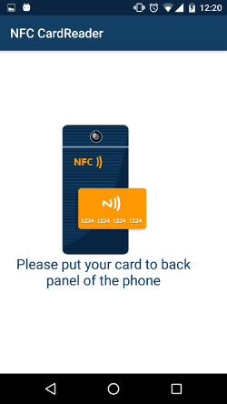
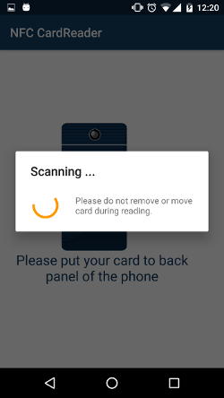
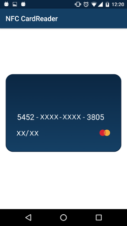

# Credit Card NFC Reader
[](https://android-arsenal.com/details/1/3501)

This library helps developer to read data from credit card: card number, expired date, card type.<br>
<i>Works only with cards that has paypass or paywave technology!</i>

1. [Screenshots](#screenshots)
2. [Usage](#usage)
3. [Callbacks](#callbacks)
4. [Proguard](#proguard)
5. [Updates](#updates)

# Screenshots




# Usage
##### Add the dependencies to your gradle file:
```sh
allprojects {
		repositories {
			...
			maven { url 'https://jitpack.io' }
		}
	}
```
	
```sh
    dependencies {
        implementation 'com.github.Nsiimbi:NFC-Credit-Card-Reader:v0.0.1'
    }
```

##### Inside your Manifest:
```sh
    <uses-permission android:name="android.permission.NFC" />
    <application
        ...
        >
        <activity
            ...
            //activity that will start when nfc scan new tag
            >
            <intent-filter>
                <action android:name="android.nfc.action.TECH_DISCOVERED" />
                <category android:name="android.intent.category.DEFAULT" />
            </intent-filter>
            <meta-data
                android:name="android.nfc.action.TECH_DISCOVERED"
                android:resource="@xml/nfc_tech_filter" />
        </activity>
```
##### Add the xml file 'nfc_tech_filter':
```sh
    <resources >
      <tech-list>
          <tech>android.nfc.tech.IsoDep</tech>
      </tech-list>
    </resources>
```

##### Inside your activity or fragment:
```sh
    @Override
    protected void onCreate(Bundle savedInstanceState) {
    ...
        mNfcAdapter = NfcAdapter.getDefaultAdapter(this);
        if (mNfcAdapter == null){
            //do something if there are no nfc module on device
        } else {
            //do something if there are nfc module on device
            
            mCardNfcUtils = new CardNfcUtils(this);
            //next few lines here needed in case you will scan credit card when app is closed
            mIntentFromCreate = true;
            onNewIntent(getIntent());
        }
    }
    ...
    @Override
    protected void onResume() {
        super.onResume();
        mIntentFromCreate = false;
        if (mNfcAdapter != null && !mNfcAdapter.isEnabled()){
            //show some turn on nfc dialog here. take a look in the samle ;-)
        } else if (mNfcAdapter != null){
            mCardNfcUtils.enableDispatch();
        }
    }
    ...
    @Override
    public void onPause() {
        super.onPause();
        if (mNfcAdapter != null) {
            mCardNfcUtils.disableDispatch();
        }
    }
    ...
    @Override
    protected void onNewIntent(Intent intent) {
        super.onNewIntent(intent);
        if (mNfcAdapter != null && mNfcAdapter.isEnabled()) {
            //this - interface for callbacks
            //intent = intent :)
            //mIntentFromCreate - boolean flag, for understanding if onNewIntent() was called from onCreate or not
            mCardNfcAsyncTask = new CardNfcAsyncTask.Builder(this, intent, mIntentFromCreate)
                    .build();
        }
    }
```
That's pretty much all what you need to start the work!

---

### Callbacks:

This is the main callback for managing:
 
```sh
    @Override
    public void startNfcReadCard() {
        //notify user that scannig start
    }

    @Override
    public void cardIsReadyToRead() {
        String card = mCardNfcAsyncTask.getCardNumber();
        String expiredDate = mCardNfcAsyncTask.getCardExpireDate();
        String cardType = mCardNfcAsyncTask.getCardType();
    }

    @Override
    public void doNotMoveCardSoFast() {
        //notify user do not move the card
    }

    @Override
    public void unknownEmvCard() {
        //notify user that current card has unnown nfc tag
    }

    @Override
    public void cardWithLockedNfc() {
        //notify user that current card has locked nfc tag
    }

    @Override
    public void finishNfcReadCard() {
        //notify user that scannig finished
    }
```

### Proguard
If you are using Proguard, please add this line to your proguard-rules.pro file
```
-keep class com.noveogroup.android.log.** { *; }
```

### Updates
* v.1.0.0
    1. Add Ingdirect Bank visa card (Australian Bank)
    2. Add default card type as <b>UNKNOWN</b>.
